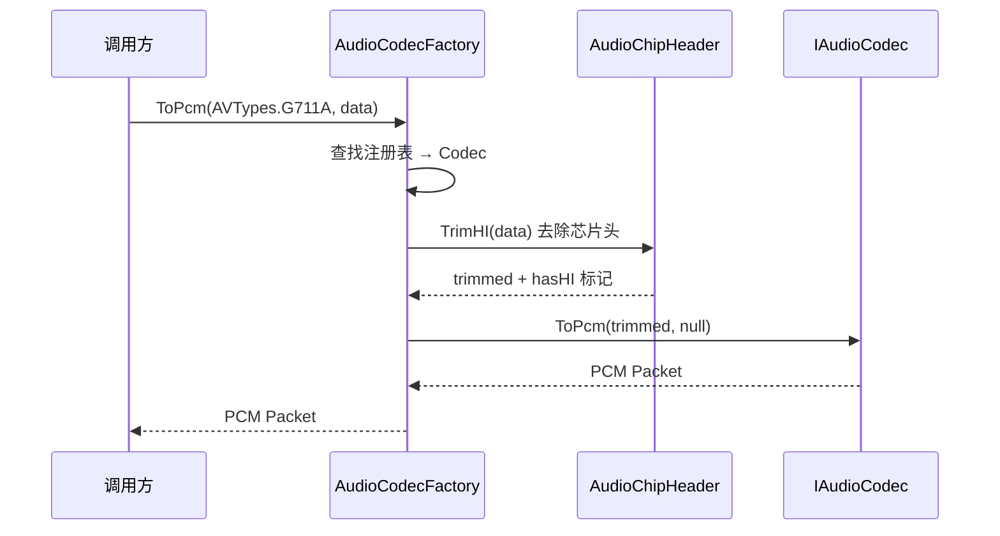
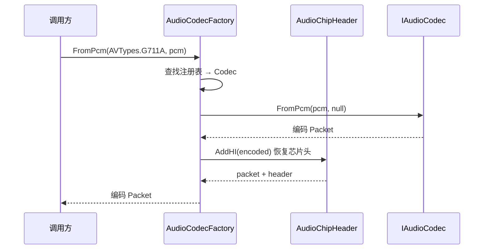
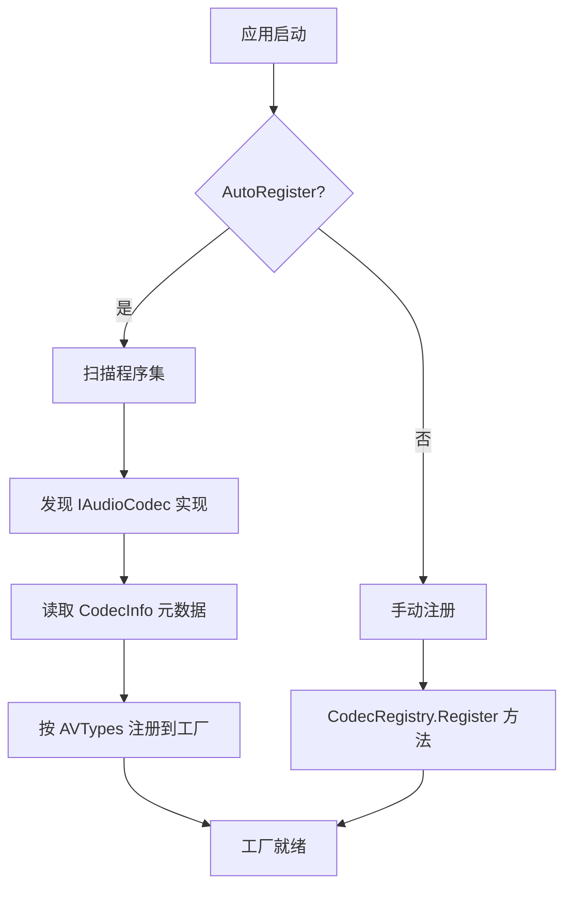

# M1-编解码引擎

> 版本：v1.0 | 日期：2026-06-29
> 需求对应：[需求文档](需求文档.md) 第 2 章 | 功能清单：[功能模块清单](功能模块清单.md)

---

## 1. 模块职责

| 职责 | 说明 |
|---|---|
| 编解码路由 | 根据编码类型（`AVTypes` 枚举或自定义标识）将数据路由到正确的编解码器 |
| PCM 双向转换 | 提供统一接口 `IAudioCodec`，输入编码数据→输出 PCM，或输入 PCM→输出编码数据 |
| 芯片音频头适配 | 自动识别和去除 IoT 芯片对音频数据的包装头（海思/大华/宇视等），解码后还原 |
| 编解码器生命周期 | 管理编解码器实例的创建、复用和释放（有状态/无状态编解码器分别处理） |
| 格式自动检测 | 根据数据特征自动推断音频编码格式，降低调用方心智负担 |

---

## 2. 核心组件

| 组件 | 说明 |
|---|---|
| `IAudioCodec` | 编解码器统一接口：`ToPcm(Packet, Object)` / `FromPcm(Packet, Object)` |
| `ICodecInfo` | 编解码器元数据接口，提供名称、版本、支持格式、是否为有状态编解码器等 |
| `AudioCodecFactory` | 编解码工厂，管理编解码器注册表，根据 `AVTypes` 或格式字符串路由 |
| `CodecRegistry` | 编解码器注册表，支持通过特性或代码手动注册，支持优先级排序 |
| `ADPCMCodec` | IMA ADPCM 编解码器（已有，无状态，类级单例） |
| `G711ACodec` | G.711 A-law 编解码器（已有，无状态，类级单例） |
| `G711UCodec` | G.711 μ-law 编解码器（已有解码，待补编码） |
| `AacEncoder` | AAC 编码器（已有 FaacEncoder，待改造接入工厂，待新增解码） |
| `OpusCodec` | Opus 编解码器（新增，包装 libopus） |
| `Mp3Codec` | MP3 编解码器（新增，解码纯 C#，编码可选原生 MP3 编码库） |
| `FlacCodec` | FLAC 编解码器（新增） |
| `VorbisCodec` | Ogg Vorbis 编解码器（新增） |
| `AudioChipHeader` | 芯片音频头处理器抽象，子类实现各厂商的头识别与处理 |

---

## 3. 关键流程

### 3.1 解码流程（设备音频 → PCM）



### 3.2 编码流程（PCM → 设备音频）



### 3.3 编解码器注册流程



---

## 4. 接口/数据结构

### 4.1 核心接口（已有 + 扩展）

```csharp
/// <summary>音频编解码器接口</summary>
public interface IAudioCodec
{
    /// <summary>编码数据转为 PCM</summary>
    Packet ToPcm(Packet audio, Object option);

    /// <summary>PCM 转为编码数据</summary>
    Packet FromPcm(Packet pcm, Object option);
}

/// <summary>编解码器元数据（新增）</summary>
public interface ICodecInfo
{
    /// <summary>编解码器名称</summary>
    String Name { get; }

    /// <summary>版本号</summary>
    String Version { get; }

    /// <summary>支持的编码类型列表</summary>
    AVTypes[] SupportedTypes { get; }

    /// <summary>是否为有状态编解码器（需要创建新实例处理每个流）</summary>
    Boolean IsStateful { get; }
}
```

### 4.2 编解码工厂扩展

```csharp
/// <summary>编解码工厂（改造后）</summary>
public class AudioCodecFactory
{
    // 编解码器注册表
    private readonly CodecRegistry _registry = new();

    /// <summary>注册编解码器</summary>
    public void Register(IAudioCodec codec, ICodecInfo info);

    /// <summary>根据编码类型解码</summary>
    public Packet ToPcm(AVTypes avType, Packet data);

    /// <summary>根据编码类型编码</summary>
    public Packet FromPcm(AVTypes avType, Packet pcm);
}
```

### 4.3 芯片音频头处理

```csharp
/// <summary>芯片音频头处理器（新增）</summary>
public interface IAudioChipHeader
{
    /// <summary>芯片厂商名称</summary>
    String Vendor { get; }

    /// <summary>尝试去除音频头，返回去除后的数据和是否成功</summary>
    Boolean TryTrim(Packet data, out Packet trimmed);

    /// <summary>尝试添加音频头，返回是否成功</summary>
    Boolean TryAdd(Packet data, out Packet result);
}

// 已有：海思头（AudioCodecFactory 内置）
// 新增：HisiliconHeader / DahuaHeader / UniviewHeader
```

---

## 5. 设计决策

| 决策 | 理由 |
|---|---|
| 接口不引入 `Span<Byte>` | 需兼容 `net461`/`netstandard2.0`，`Packet` 是 NewLife 标准高性能缓冲区 |
| 无状态编解码器使用类级单例 | 如 G.711/ADPCM 不保存流状态，一个实例服务多路数据，避免重复分配 |
| 有状态编解码器每个流独立实例 | 如 Opus/AAC 需保存帧间状态，工厂按需创建和管理 |
| `option` 参数保留 `Object` 类型 | 各编解码器配置差异大，统一为 `Object` 避免接口膨胀 |
| 芯片头处理从工厂内部提取为独立接口 | 便于新增厂商适配，不修改工厂核心逻辑 |

---

（完）
