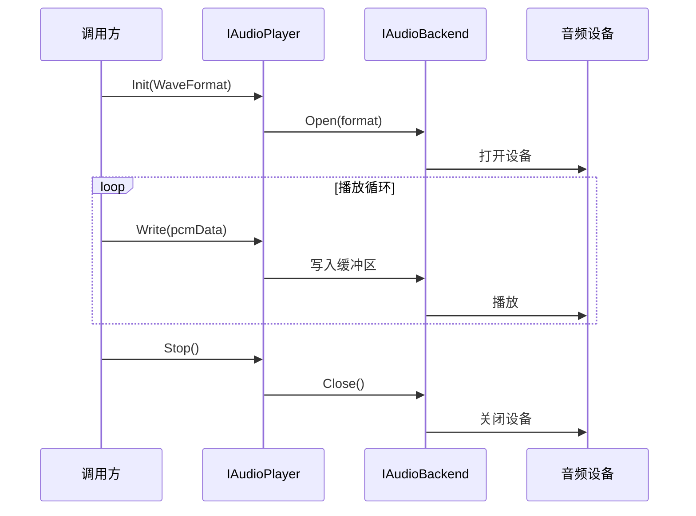
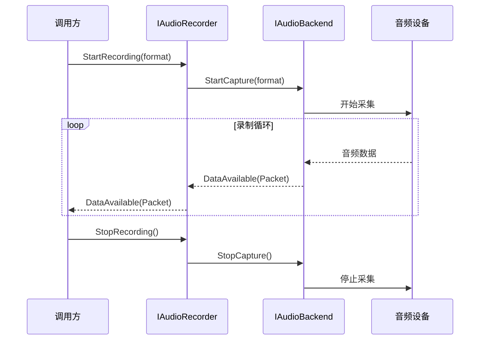
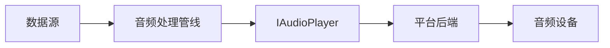

# M2-音频设备IO

> 版本：v1.0 | 日期：2026-06-29
> 需求对应：[需求文档](需求文档.md) 第 3 章 | 功能清单：[功能模块清单](功能模块清单.md)

---

## 1. 模块职责

| 职责 | 说明 |
|---|---|
| 设备发现 | 枚举系统音频输入/输出设备，获取名称、通道数、格式支持等元数据 |
| 音频播放 | 将 PCM/编码数据推送到音频输出设备 |
| 音频录制 | 从音频输入设备采集原始 PCM 数据 |
| 后端适配 | 封装 Windows(WaveOut/WASAPI/ASIO)、Linux(ALSA/PulseAudio)、macOS(CoreAudio) 原生API |
| 生命周期管理 | 播放/录制会话的启停、暂停、恢复、缓冲区管理 |

---

## 2. 核心组件

| 组件 | 说明 |
|---|---|
| `AudioDeviceManager` | 设备管理器：枚举设备、默认设备选择、设备变更事件 |
| `IAudioPlayer` | 播放器接口：`Play()`/`Pause()`/`Stop()`/`Init(WaveFormat)` |
| `IAudioRecorder` | 录音器接口：`StartRecording()`/`StopRecording()`/`DataAvailable` 事件 |
| `WaveFormat` | 音频格式描述：采样率、位深、声道数、编码类型 |
| `WaveOutBackend` | Windows WaveOut API 后端实现 |
| `WASAPIBackend` | Windows WASAPI 后端实现（共享/独占模式） |
| `ASIOBackend` | Windows ASIO 后端实现 |
| `ALSABackend` | Linux ALSA 后端实现 |
| `PulseAudioBackend` | Linux PulseAudio 后端实现 |
| `CoreAudioBackend` | macOS CoreAudio 后端实现 |
| `IAudioBackend` | 后端适配器统一接口 |
| `AudioBackendFactory` | 后端工厂：根据平台自动选择最优后端 |

---

## 3. 关键流程

### 3.1 播放流程



### 3.2 录制流程



### 3.3 播放器 + 信号链整合（与 M3 协同）



---

## 4. 接口/数据结构

### 4.1 核心接口

```csharp
/// <summary>音频格式描述</summary>
public class WaveFormat
{
    /// <summary>采样率（Hz）</summary>
    public Int32 SampleRate { get; set; }

    /// <summary>位深（8/16/24/32）</summary>
    public Int32 BitsPerSample { get; set; }

    /// <summary>声道数</summary>
    public Int32 Channels { get; set; }

    /// <summary>编码类型</summary>
    public AVTypes Encoding { get; set; }

    /// <summary>每秒字节数</summary>
    public Int32 BytesPerSecond => SampleRate * BitsPerSample * Channels / 8;

    /// <summary>每帧字节数</summary>
    public Int32 BlockAlign => BitsPerSample * Channels / 8;
}

/// <summary>音频设备信息</summary>
public class AudioDeviceInfo
{
    public String Id { get; set; }
    public String Name { get; set; }
    public Boolean IsInput { get; set; }
    public Boolean IsDefault { get; set; }
    public WaveFormat[] SupportedFormats { get; set; }
}

/// <summary>音频播放器接口</summary>
public interface IAudioPlayer : IDisposable
{
    Boolean Init(WaveFormat format);
    void Play();
    void Pause();
    void Stop();
    void Write(Packet data);
    Int32 BufferedBytes { get; }
    event EventHandler PlaybackStopped;
}

/// <summary>音频录制器接口</summary>
public interface IAudioRecorder : IDisposable
{
    Boolean Init(WaveFormat format);
    void StartRecording();
    void StopRecording();
    event EventHandler<Packet> DataAvailable;
    event EventHandler RecordingStopped;
}
```

### 4.2 后端适配器

```csharp
/// <summary>音频后端接口（内部使用）</summary>
public interface IAudioBackend
{
    String Name { get; }
    PlatformID[] SupportedPlatforms { get; }
    AudioDeviceInfo[] EnumerateDevices();
    AudioDeviceInfo GetDefaultDevice(Boolean input);
    IAudioPlayer CreatePlayer(AudioDeviceInfo device);
    IAudioRecorder CreateRecorder(AudioDeviceInfo device);
}
```

---

## 5. 设计决策

| 决策 | 理由 |
|---|---|
| 后端适配器模式 | 不同平台/API 差异巨大，适配器模式隔离变化，核心接口保持稳定 |
| 同步 `Write()` + 异步事件 `DataAvailable` | 播放是调用方主动推送（同步写），录制是被动接收（事件回调），符合各自语义 |
| `WaveFormat` 包含 `AVTypes` | 支持编码音频直接播放（如 G.711 设备输出），不只是原始 PCM |
| 后端按平台条件编译 | `net461` 加载 WaveOut/WASAPI/ASIO；Linux 加载 ALSA/PulseAudio；macOS 加载 CoreAudio |
| 优先平台原生 API | 不用第三方跨平台抽象库（增加原生依赖），直接调用 OS API，零依赖 |

---

（完）
