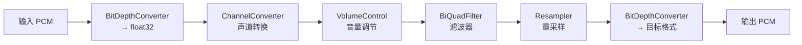
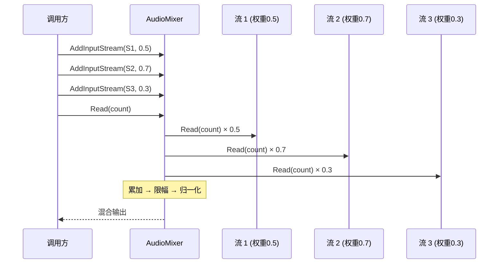
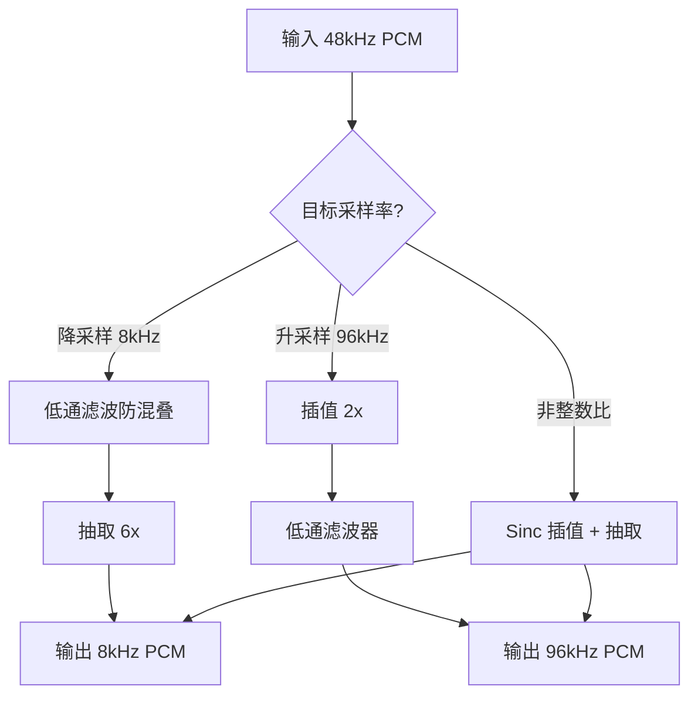

# M3-音频处理DSP

> 版本：v1.0 | 日期：2026-06-29
> 需求对应：[需求文档](需求文档.md) 第 4 章 | 功能清单：[功能模块清单](功能模块清单.md)

---

## 1. 模块职责

| 职责 | 说明 |
|---|---|
| 信号链管线 | 提供 `IAudioPipeline` 将多个 DSP 处理器串联，数据依次流过每个节点 |
| 基础变换 | 重采样、声道转换、位深度/采样格式转换——任何音频流都可能用到的通用处理 |
| 效果处理 | 音量、均衡器、滤波器、压缩器、变速变调等艺术/工程向处理 |
| 频谱分析 | FFT 频谱输出，用于可视化、音频特征提取和计量 |
| 混音 | 多路音频流按权重混合，保持精度避免溢出 |

---

## 2. 核心组件

| 组件 | 说明 |
|---|---|
| `IAudioProcessor` | DSP 处理器统一接口：输入 32-bit 浮点样本 → 处理 → 输出 32-bit 浮点样本 |
| `AudioPipeline` | 信号链管线：有序持有多个 `IAudioProcessor`，数据流式传递 |
| `Resampler` | 重采样器：线性插值、Sinc 插值（加窗） |
| `ChannelConverter` | 声道转换：单声道↔立体声↔多声道，自定义映射矩阵 |
| `BitDepthConverter` | 位深/格式转换：8/16/24/32 int ↔ 32 float |
| `VolumeControl` | 音量控制：线性/对数增益，静音检测，峰值限幅 |
| `AudioMixer` | 混音器：多通道加权混合，32-bit 累加后归一化 |
| `FftAnalyzer` | FFT 分析：窗函数、幅度谱/功率谱、频率分辨率 |
| `Equalizer` | 均衡器：多段参数均衡，低架/峰值/高架组合 |
| `BiQuadFilter` | BiQuad 滤波器：低通/高通/带通/带阻/峰值/低架/高架 |
| `DynamicCompressor` | 压缩器：阈值/压缩比/启音/释放/增益补偿 |
| `FadeProcessor` | 淡入淡出：线性/对数/余弦曲线 |
| `PitchShifter` | 变调器：改变音高保持速度 |
| `SpeedChanger` | 变速器：改变播放速度（可选是否保持音高） |

---

## 3. 关键流程

### 3.1 信号链管线处理流程



### 3.2 混音流程



### 3.3 重采样流程



---

## 4. 接口/数据结构

### 4.1 核心接口

```csharp
/// <summary>DSP 处理器统一接口</summary>
public interface IAudioProcessor
{
    /// <summary>处理器的输入格式</summary>
    WaveFormat InputFormat { get; }

    /// <summary>处理器的输出格式（可能因处理改变）</summary>
    WaveFormat OutputFormat { get; }

    /// <summary>读取处理后的采样数据</summary>
    /// <param name="buffer">输出缓冲区（32-bit 浮点，交错声道）</param>
    /// <param name="offset">起始偏移</param>
    /// <param name="count">采样数（非字节数）</param>
    /// <returns>实际读取的采样数</returns>
    Int32 Read(Single[] buffer, Int32 offset, Int32 count);

    /// <summary>设置输入源（链式组合）</summary>
    IAudioProcessor Source { get; set; }
}

/// <summary>音频处理管线</summary>
public class AudioPipeline : IAudioProcessor
{
    /// <summary>按顺序添加处理器</summary>
    public void AddProcessor(IAudioProcessor processor);

    /// <summary>移除处理器</summary>
    public Boolean RemoveProcessor(IAudioProcessor processor);

    /// <summary>处理器列表</summary>
    public IReadOnlyList<IAudioProcessor> Processors { get; }
}
```

### 4.2 混音器接口

```csharp
/// <summary>混音器</summary>
public class AudioMixer : IAudioProcessor
{
    /// <summary>添加输入流</summary>
    /// <param name="source">输入源</param>
    /// <param name="gain">增益系数（0.0 ~ 1.0）</param>
    public void AddInputStream(IAudioProcessor source, Single gain = 1.0f);

    /// <summary>移除输入流</summary>
    public Boolean RemoveInputStream(IAudioProcessor source);
}
```

### 4.3 通用处理器构造

```csharp
// 处理器链的流畅 API
var pipeline = new AudioPipeline();
pipeline
    .Append(new BitDepthConverter())   // 16-bit → float32
    .Append(new VolumeControl(0.8f))   // 80% 音量
    .Append(new BiQuadFilter.LowPass(3000, 44100)) // 3kHz 低通
    .Append(new Resampler(8000));      // 重采样到 8kHz
```

---

## 5. 设计决策

| 决策 | 理由 |
|---|---|
| 内部统一 32-bit 浮点处理 | 避免整数溢出，支持负增益和效果叠加，业界通行的信号链内部格式 |
| `IAudioProcessor.Source` 链式组合 | 借鉴业界信号链模式，每个处理器只有一个上游源，天然形成单向处理链 |
| 处理器不关心具体传输层 | 处理器只从 `Source.Read()` 拉数据，不关心数据来自文件/网络/设备 |
| WaveOut/WASAPI 等播放后端也实现 `IAudioProcessor` | 播放后端作为管线终点，统一 `Source → Processor1 → ... → Player` |
| 混音器同步等待所有输入 | 避免异步时序复杂性。多源时间对齐由调用方保证 |
| BiQuad 滤波器使用 Robert Bristow-Johnson 公式 | 系数计算标准、稳定，业界广泛使用该算法 |

---

（完）
