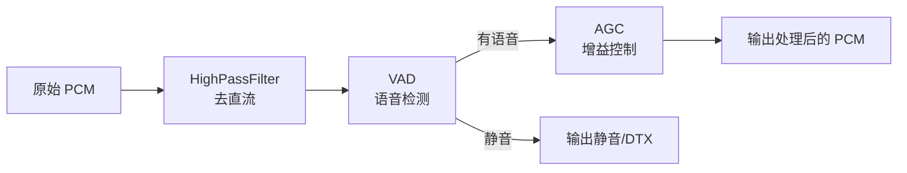
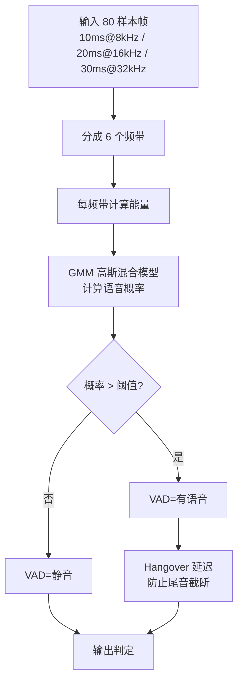
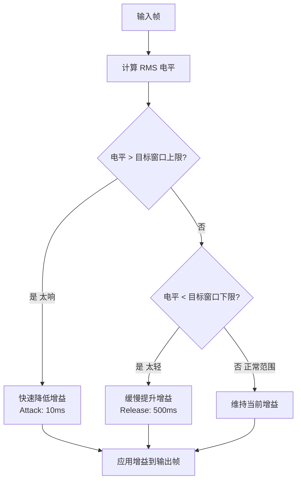

# M4-语音处理

> 版本：v1.0 | 日期：2026-06-29
> 需求对应：[需求文档](需求文档.md) 第 5 章 | 功能清单：[功能模块清单](功能模块清单.md)

> ⚠️ 本模块为中优先级，第二阶段实施。当前仅完成架构设计。

---

## 1. 模块职责

| 职责 | 说明 |
|---|---|
| 语音活动检测 | 检测音频流中人声的存在，输出 VAD 概率或二元判定 |
| 自动增益控制 | 动态调节输入增益，使输出电平保持恒定，避免忽大忽小 |
| 语音前端管线 | 将 VAD、AGC、高通滤波等组合为即开即用的语音预处理链 |
| 噪声抑制（远期） | 抑制稳态背景噪声，提升语音信噪比 |
| 回声消除（远期） | 消除扬声器→麦克风的声学回路，实现全双工通话 |

---

## 2. 核心组件

| 组件 | 说明 |
|---|---|
| `IVoiceActivityDetector` | VAD 接口：输入 PCM 帧，输出语音概率（0.0~1.0）或二元结果 |
| `GmmVad` | GMM 模型 VAD 纯 C# 实现：6 子带分析 |
| `IAutomaticGainControl` | AGC 接口：输入/输出 PCM，内部维护增益状态 |
| `SimpleAgc` | 简单 AGC：目标电平窗口，慢启快放 |
| `HighPassFilter` | 高通滤波器：去除直流偏移和低频噪声（基于 BiQuad 滤波器） |
| `VoicePreprocessor` | 语音前置管线：串联 VAD → AGC → HighPass → NoiseSuppressor |
| `INoiseSuppressor` | 噪声抑制接口（远期） |

---

## 3. 关键流程

### 3.1 语音前置处理管线



### 3.2 GMM VAD 算法流程



### 3.3 AGC 自适应增益



---

## 4. 接口/数据结构

### 4.1 核心接口

```csharp
/// <summary>语音活动检测器接口</summary>
public interface IVoiceActivityDetector
{
    /// <summary>检测模式（0~3，越大约激进）</summary>
    Int32 Aggressiveness { get; set; }

    /// <summary>检测单帧是否含语音</summary>
    /// <param name="frame">PCM 音频帧</param>
    /// <returns>是否含语音</returns>
    Boolean IsSpeech(Packet frame);

    /// <summary>检测单帧语音概率</summary>
    /// <param name="frame">PCM 音频帧</param>
    /// <returns>语音概率 0.0~1.0</returns>
    Single GetSpeechProbability(Packet frame);
}

/// <summary>自动增益控制器接口</summary>
public interface IAutomaticGainControl : IAudioProcessor
{
    /// <summary>目标电平（dBFS）</summary>
    Single TargetLevel { get; set; }

    /// <summary>增益提升速度（Attack，秒）</summary>
    Single AttackTime { get; set; }

    /// <summary>增益恢复速度（Release，秒）</summary>
    Single ReleaseTime { get; set; }

    /// <summary>当前增益值（dB）</summary>
    Single CurrentGain { get; }

    /// <summary>最大增益（dB，防止噪声放大）</summary>
    Single MaxGain { get; set; }
}

/// <summary>语音前置处理管线</summary>
public class VoicePreprocessor : IAudioProcessor
{
    /// <summary>启用/禁用 VAD</summary>
    public Boolean EnableVAD { get; set; }

    /// <summary>启用/禁用 AGC</summary>
    public Boolean EnableAGC { get; set; }

    /// <summary>静音时输出静音包还是原数据</summary>
    public Boolean SilenceOnVad { get; set; }
}
```

### 4.2 GMM VAD 关键参数

| 参数 | 值 | 说明 |
|---|---|---|
| 帧长 | 80/160/240 样本 | 对应 10ms(8k)/10ms(16k)/10ms(32k) |
| 采样率 | 8000/16000/32000 Hz | 仅支持这三种采样率 |
| 频带数 | 6 | 80~250Hz, 250~500Hz, 500~1kHz, 1~2kHz, 2~3kHz, 3~4kHz |
| 模型 | GMM（高斯混合模型） | 2 分量高斯混合，预训练权重 |
| 激进模式 | 0/1/2/3 | 0=最保守(漏检少)，3=最激进(误检少) |
| Hangover | ~200ms | 语音结束后持续判定有语音的延迟 |

---

## 5. 设计决策

| 决策 | 理由 |
|---|---|
| GMM VAD 纯 C# 实现 | 算法简单、参数少、无外部依赖，纯 C# 实现完全可行 |
| VAD 只支持 8k/16k/32kHz | 与标准实现一致，其他采样率先经 M3 重采样到 8kHz 再送入 |
| AGC 使用慢启快放策略 | 防止语音起始被增益压掉（慢启），静音后快速恢复增益（快放） |
| AGC 实现 `IAudioProcessor` | 可无缝接入 M3 信号链管线 |
| 语音前置管线默认静音输出为静音包 | IoT 对讲场景下，带宽敏感时不应传输静音帧（DTX） |
| AEC 和高质量 NS 设为远期暂缓 | 纯 C# 实现质量难以达标，需评估引入原生库的成本收益 |

---

（完）
