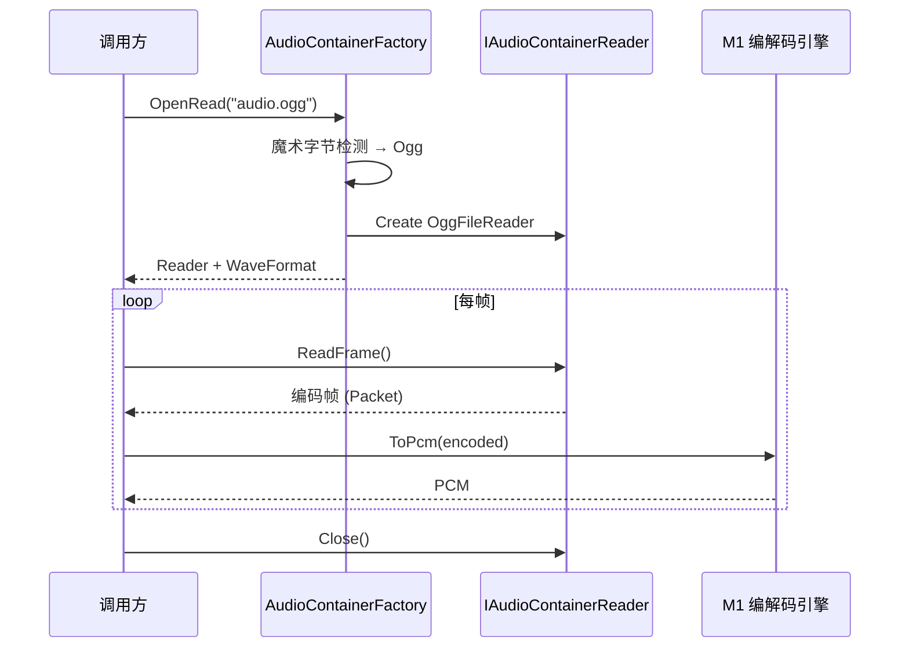
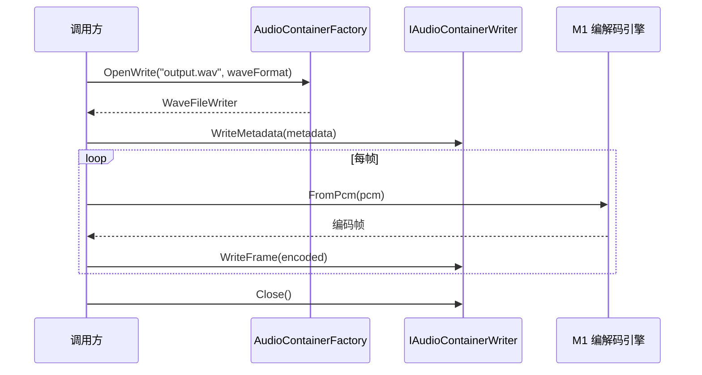
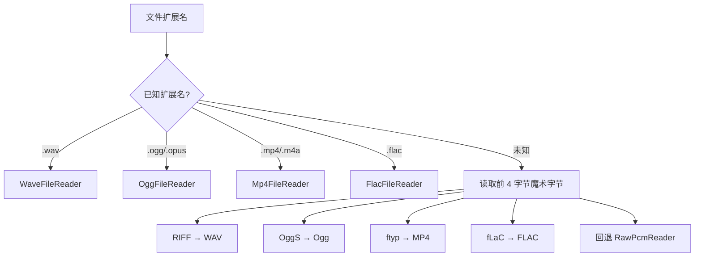

# M5-容器格式

> 版本：v1.0 | 日期：2026-06-29
> 需求对应：[需求文档](需求文档.md) 第 6 章 | 功能清单：[功能模块清单](功能模块清单.md)

---

## 1. 模块职责

| 职责 | 说明 |
|---|---|
| 音频文件读取 | 解析容器格式（WAV/Ogg/MP4/FLAC），提取编码音频数据和格式元数据 |
| 音频文件写入 | 将编码音频数据封装为容器格式，写入正确的头部和数据块 |
| 格式自动识别 | 根据文件扩展名或魔术字节自动选择读写器 |
| 元数据管理 | 读取/写入标签信息（艺术家、标题、专辑等） |

---

## 2. 核心组件

| 组件 | 说明 |
|---|---|
| `IAudioContainerReader` | 容器读取器接口：`Open()`→`ReadFrame()`→`Close()` |
| `IAudioContainerWriter` | 容器写入器接口：`Open()`→`WriteFrame()`→`WriteMetadata()`→`Close()` |
| `AudioContainerFactory` | 容器工厂：根据格式自动创建读写器 |
| `WaveFileReader` / `WaveFileWriter` | WAV 容器读写器 |
| `OggFileReader` / `OggFileWriter` | Ogg 容器读写器（支持 Vorbis + Opus） |
| `Mp4FileReader` / `Mp4FileWriter` | MP4/M4A 容器读写器 |
| `FlacFileReader` / `FlacFileWriter` | FLAC 原生容器读写器 |
| `RawPcmReader` | 原始 PCM 解析器：手动指定或自动推断格式 |
| `AudioMetadata` | 音频元数据模型（标题、艺术家、专辑、时长、码率等） |

---

## 3. 关键流程

### 3.1 文件读取流程



### 3.2 文件写入流程



### 3.3 格式自动识别流程



---

## 4. 接口/数据结构

### 4.1 核心接口

```csharp
/// <summary>容器读取器接口</summary>
public interface IAudioContainerReader : IDisposable
{
    /// <summary>音频格式</summary>
    WaveFormat WaveFormat { get; }

    /// <summary>编码类型</summary>
    AVTypes CodecType { get; }

    /// <summary>总帧数（未知时返回 -1）</summary>
    Int64 TotalFrames { get; }

    /// <summary>音频时长（未知时返回 TimeSpan.Zero）</summary>
    TimeSpan Duration { get; }

    /// <summary>音频元数据</summary>
    AudioMetadata Metadata { get; }

    /// <summary>读取下一帧编码数据</summary>
    /// <returns>编码后的音频帧，流结束返回 null</returns>
    Packet ReadFrame();

    /// <summary>定位到指定帧</summary>
    Boolean SeekFrame(Int64 frameIndex);
}

/// <summary>容器写入器接口</summary>
public interface IAudioContainerWriter : IDisposable
{
    /// <summary>写入元数据</summary>
    void WriteMetadata(AudioMetadata metadata);

    /// <summary>写入一帧编码数据</summary>
    void WriteFrame(Packet encodedFrame);

    /// <summary>完成写入（写入尾部索引等）</summary>
    void Flush();
}
```

### 4.2 数据结构

```csharp
/// <summary>音频元数据</summary>
public class AudioMetadata
{
    public String Title { get; set; }
    public String Artist { get; set; }
    public String Album { get; set; }
    public String Genre { get; set; }
    public Int32 TrackNumber { get; set; }
    public Int32 Year { get; set; }
    public String Comment { get; set; }
    public Byte[] CoverImage { get; set; }
    public String CoverImageMimeType { get; set; }
}
```

### 4.3 WAV 文件结构

```
RIFF Header (12 bytes)
├── "RIFF" (4 bytes)
├── File Size - 8 (4 bytes, LE)
├── "WAVE" (4 bytes)
fmt  Chunk (24 bytes)
├── "fmt " (4 bytes)
├── Chunk Size = 16 (4 bytes, LE)
├── Audio Format = 1 (PCM) (2 bytes)
├── Channels (2 bytes)
├── Sample Rate (4 bytes)
├── Byte Rate (4 bytes)
├── Block Align (2 bytes)
├── Bits Per Sample (2 bytes)
data Chunk
├── "data" (4 bytes)
├── Data Size (4 bytes, LE)
└── PCM/编码数据...
```

---

## 5. 设计决策

| 决策 | 理由 |
|---|---|
| 容器与编解码分离 | 容器只负责解析/封装，编码数据交给 M1 处理，职责清晰 |
| 读取器不自动解码 | 调用方按需选择解码或不解码（如仅需转发编码数据），灵活性最高 |
| `RawPcmReader` 支持格式推断 | IoT 场景大量原始 PCM 数据，自动推断减少调用方心智负担 |
| 元数据与音频数据分离 | 写入时元数据可提前设置，不与帧数据混在一起 |
| Ogg 容器同时支持 Vorbis 和 Opus | Ogg 是 Opus 的标准容器（RFC 7845），一石二鸟 |

---

（完）
