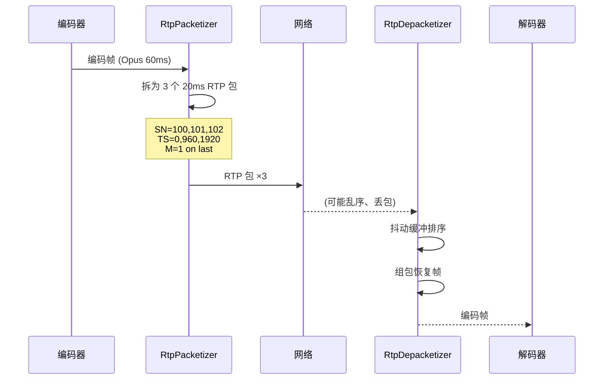
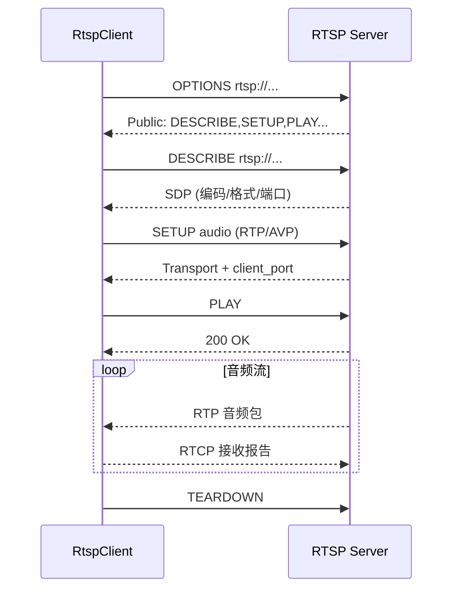

# M6-流媒体传输

> 版本：v1.0 | 日期：2026-06-29
> 需求对应：[需求文档](需求文档.md) 第 7 章 | 功能清单：[功能模块清单](功能模块清单.md)

> ⚠️ 本模块为远期规划，当前仅完成架构设计。具体实施依赖 M1~M5 模块成熟度。

---

## 1. 模块职责

| 职责 | 说明 |
|---|---|
| RTP 封包与解包 | 按 RFC 3550 将音频帧封装为 RTP 包，或从 RTP 包中解析音频帧 |
| 流媒体客户端 | RTSP/HTTP 流拉取，支持连接、播放、断开等生命周期 |
| 流媒体服务端 | RTSP/HTTP 流推送，向多客户端广播音频 |
| WebSocket 实时传输 | 基于 WebSocket 的低延迟双向音频管道，服务 Web 端对讲场景 |
| 抖动缓冲 | 网络接收端缓冲管理，平滑网络抖动，保证连续播放 |

---

## 2. 核心组件

| 组件 | 说明 |
|---|---|
| `RtpPacket` | RTP 包数据结构：头部字段（V/P/X/CC/M/PT/SN/TS/SSRC/CSRC） + 载荷 |
| `RtpPacketizer` | RTP 封包器：音频帧 → 一个或多个 RTP 包（分片） |
| `RtpDepacketizer` | RTP 解包器：RTP 包 → 音频帧（组包） |
| `RtpSession` | RTP 会话管理：SSRC、序列号、时间戳递增 |
| `RtspClient` | RTSP 客户端：DESCRIBE/SETUP/PLAY/TEARDOWN 协议交互 |
| `RtspServer` | RTSP 服务端：接受客户端连接，推送音频流 |
| `IAudioStreamSource` | 音频流源接口：提供编码音频帧 + 格式信息 |
| `IAudioStreamSink` | 音频流目标接口：消费编码音频帧 |
| `JitterBuffer` | 抖动缓冲：可配置延迟窗口，排序、去重、丢包补偿 |
| `WebSocketAudioPipe` | WebSocket 音频管道：封装音频帧为 WebSocket 消息，双向传输 |

---

## 3. 关键流程

### 3.1 RTP 封包与解包流程



### 3.2 RTSP 拉流流程



### 3.3 WebSocket 实时对讲流程


---

## 4. 接口/数据结构

### 4.1 RTP 包结构

```csharp
/// <summary>RTP 包</summary>
public class RtpPacket
{
    // 固定头部
    public Byte Version { get; set; }        // 2
    public Boolean Padding { get; set; }
    public Boolean Extension { get; set; }
    public Byte CsrcCount { get; set; }
    public Boolean Marker { get; set; }
    public Byte PayloadType { get; set; }     // 0=PCMU, 8=PCMA, 96=Opus, 97=AAC...
    public UInt16 SequenceNumber { get; set; }
    public UInt32 Timestamp { get; set; }
    public UInt32 Ssrc { get; set; }
    public UInt32[] CsrcList { get; set; }

    // 载荷
    public Packet Payload { get; set; }

    /// <summary>序列化为网络字节序</summary>
    public Packet ToPacket();

    /// <summary>从网络字节序反序列化</summary>
    public static RtpPacket FromPacket(Packet data);
}
```

### 4.2 流传输接口

```csharp
/// <summary>音频流源</summary>
public interface IAudioStreamSource
{
    WaveFormat Format { get; }
    AVTypes CodecType { get; }
    event EventHandler<Packet> FrameAvailable;
}

/// <summary>音频流目标</summary>
public interface IAudioStreamSink
{
    void OnFrame(Packet encodedFrame);
}
```

### 4.3 RTSP 客户端

```csharp
/// <summary>RTSP 客户端</summary>
public class RtspClient : IDisposable
{
    /// <summary>连接到 RTSP 服务端</summary>
    public Task ConnectAsync(String url);

    /// <summary>开始接收音频流</summary>
    public Task PlayAsync();

    /// <summary>暂停</summary>
    public Task PauseAsync();

    /// <summary>断开</summary>
    public Task TeardownAsync();

    /// <summary>接收到音频帧事件</summary>
    public event EventHandler<Packet> AudioFrameReceived;
}
```

---

## 5. 设计决策

| 决策 | 理由 |
|---|---|
| RTP 封包/解包独立于传输层 | RTP 只定义包格式，不绑定承载方式（UDP/TCP/WebSocket），可复用 |
| RTSP 使用 NewLife.Net 的 TCP 能力 | 复用 NewLife 现有网络基础设施（`NetClient`/`NetServer`），避免重复造轮子 |
| WebSocket 使用 NewLife.Http 的 WebSocket 支持 | 复用 `WebSocketSession` / `WebSocketClient` |
| 抖动缓冲可配置 | 实时对讲（20-60ms 缓冲）vs 单向广播（200-500ms 缓冲），场景差异大 |
| RTCP 简化为基本接收报告 | 完整 RTCP 协议复杂，初期仅需丢包率和抖动统计 |
| 远端实施优先级 | RTP 封包 > RTSP 客户端 > WebSocket > HTTP 流 > RTSP 服务端 |

---

（完）
